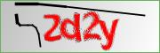
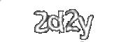
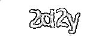
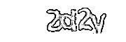
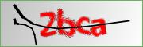
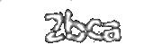
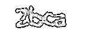
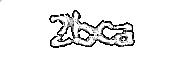

# CaptchaDetective
The model is too large to upload. But actually it is 3M, but for some unknown reasons that it goes up 30M.Later I will upload the smaller model.
By using Predict.py(`pic/xxxx.jpg`) you can input a captcha address to let the model identify it.

### picProcess.py

It has many different functions, for example, 

```python
	img_arr = img_arr[:,:,0]-img_arr[:,:,1]

    count=np.zeros((60,180),dtype=int)

    for i in range(60):
        for j in range (180):
            if img_arr[i][j]<30 or img_arr[i][j]>200:
                img_arr[i][j]=255
```


This block of codes can transfer the image into binary color(obviously black and white)





But it is not enough, so I add these codes

```python
        img = img.filter(ImageFilter.MedianFilter)
        img = img.filter(ImageFilter.CONTOUR)
        img.save(SAVE_PATH+label+".jpg")
```

Now, it's much better



I don't want to let the covnet learn the position, so I design the 3rd function(pos and scale)

```python
        box = (40,10,140,50)
        l_offset = random.randint(-25,26)
        u_offset = random.randint(-3,4)
        new_box =(40+l_offset,10+u_offset,140+l_offset,50+u_offset)
        img = img.crop(box)
        img = img.filter(ImageFilter.MedianFilter)
        img = img.filter(ImageFilter.CONTOUR)
        #Image._show(img)
        
        width = int(100 * random.uniform(0.7,1.3))
        height= int(40 * random.uniform(0.7,1.3))
        img.resize((width, height), Image.ANTIALIAS)
        new_img.paste(img,new_box)
        #Image._show(new_img)
        new_img.save(SAVE_PATH+label+".jpg")
```




MORE EXAMPLE:




